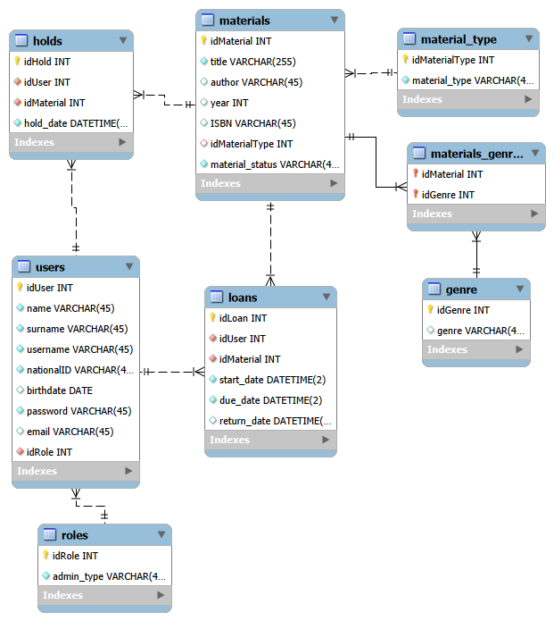

# Digital Library
This application is designed to manage a small digital library that provides a complete system for cataloging materials (books, magazines, multimedia), managing loans and returns, handling users, and tracking due dates.
The project was developed using SCRUM across four sprints.

## Requirements
- Git
- Java Development Kit (JDK) **21 or higher**
  - Developed and tested using **OpenJDK 25**
  - Language features from Java 21 are used (record patterns, pattern matching for switch)
- JDBC-compatible SQL database
  
## Installation
Download or pull the git repository LibraryManagementApplication like this:
```
git clone [https://github.com/montesinosmar/ALD_loes.git](https://github.com/marmontesinos-Unicas/LibraryManagementApplication.git)
```
To run the application open the project and execute the MainApp.java or run the following command (Windows example):

```
"C:\Users\User\.jdks\openjdk-25\bin\java.exe" --module-path "C:\path\to\javafx-sdk-23.0.1\lib" --add-modules javafx.controls,javafx.fxml -Dfile.encoding=UTF-8 -classpath "C:\path\to\LibraryManagementApplication\bin;C:\path\to\LibraryManagementApplication\lib\*" it.unicas.project.template.address.MainApp
```
Replace `APP_DIR` and `JAVA_FX` with your paths.

## Database Setup (SQL / JDBC)
The application requires an SQL database accessed via JDBC.

For quick testing, this repository provides a ready-to-use dls_schema (`db/dls_schema.sql`).

## Database Design



## Usage — Admin
(Detailed step-by-step guides with images are provided separately in the `documentation/admin-instructions.pdf` file)

- Manage catalog items (add, edit, delete).
- Edit metadata (title, author, year, genre, ISBN).
- Manage users and view loan histories.
- Authorize loans and returns (transaction-safe).
- Monitor overdue loans.

## Usage — User
(Detailed guides provided separately in the `documentation/user-instructions.pdf` file)

- Log in.
- Browse the catalog by categories or text search with dynamic filters.
- Check item availability.
- Request or reserve available items.
- View loan and hold history and current loan status.
- Receive visual notifications for due dates.


